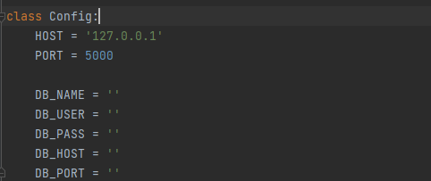

## Version
- python 3.9
- 참고 사이트: [https://docs.python.org/](https://docs.python.org/)


## Install
##### virtualenv
```
python -m venv ./venv

# window
cd venv\Scripts
activate

# linux
cd venv/bin
source activate

(venv) $ pip install -r requirements.txt
```
##### basic
```
pip install -r requirements.txt
```


## Run Server - [http://localhost:5000](http://localhost:5000)

### DB 설정
서버 실행전 DB접속 정보 입력


> config.py 파일에 'DB_NAME', 'DB_USER', 'DB_PASS', 'DB_HOST', 'DB_PORT' 변수에 접속정보 입력


##### virtualenv
```
# window
cd venv\Scripts
activate

# linux
cd venv/bin
source activate

(venv) $ python main.py
```

##### basic
```
python main.py
```

## Swagger
- [http://localhost:5000/api/docs](http://localhost:5000/api/docs)
